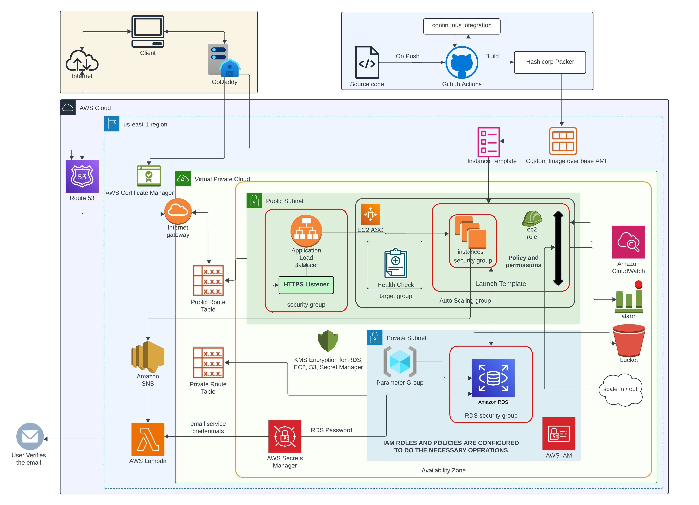

# Webapp

A scalable User Management Service built with Node.js and Express.js, supporting CRUD operations along with email verification during user registration. The infrastructure is deployed on AWS, provisioned using Terraform.

### Features
 - User Management: Provides complete CRUD functionality for managing user information.
 - Health Monitoring: Includes a dedicated endpoint to monitor the application’s health and its connected services.
 - Secure Deployment: Ensures data protection through HTTPS using SSL certificates and customer-managed encryption keys.
 - Scalability and Reliability: Achieves high availability and scalability using managed instance groups and load balancers.
 - Event-Driven Architecture: Leverages AWS SNS and lambda Functions to send verification emails through Mailgun.

### Architecture Diagram 



### Technologies used:
- Programming Language: ```JavaScript```
- Relational Database: ```PostgreSQL```
- Backend Framework: ```Node.js```, ```Express.js```
- ORM Framework: ```Sequelize```

### To run the packer build command

Create ```variables.pkrvars.hcl``` file with the following fields:

```bash
aws_profile    = ""
vpc_default    = ""
subnet_default = ""
artifact_path  = ""
ami_name       = ""
instance_type  = ""
region         = ""

db_user     = ""
db_password = "" 
db_name     = ""

source_ami_id   = ""
demo_account_id = ""
```

### To build and run the application locally

1. Generate npm packages
```bash
npm install
```
2. Add ```.env``` file 
```bash
PORT=
DB_HOST=
DB_PORT=
DB_USER=
DB_PASSWORD=
DB_DATABASE=
DB_POOL_MAX=
DB_POOL_MIN=
DB_POOL_ACQUIRE=
DB_POOL_IDLE=
BCRYPT_SALT_ROUNDS=
TOKEN_EXPIRATION_TIME=
CLOUDWATCH_LOG_GROUP=
CLOUDWATCH_LOG_STREAM=
AWS_REGION=
ENVIRONMENT=
S3_BUCKET_NAME=
AWS_PROFILE=
SNS_TOPIC_ARN=
```
3. To Run the Application
```bash
npm run start
```
4. To Debug the Application
```bash
npm run dev
```
5. To Run tests for the Application
```bash 
npm run test
```

### To Setup Infra with Terraform 

 - refer the tf-aws-infra repo - [link to IaC repo](https://github.com/NeoCompute/tf-aws-infra)

### References

1. [Creating users and managing psql](https://medium.com/coding-blocks/creating-user-database-and-adding-access-on-postgresql-8bfcd2f4a91e)
2. [Sequelize](https://sequelize.org/docs/v6/getting-started/)
3. [Cache-Control](https://developer.mozilla.org/en-US/docs/Web/HTTP/Headers/Cache-Control)
4. [HTTP Status Codes](https://developer.mozilla.org/en-US/docs/Web/HTTP/Status)
